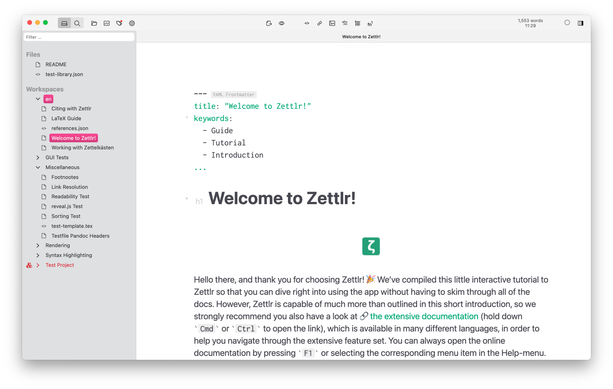

# 入门指南

在安装好Zettlr后，你可能想马上开始使用它。在初次启动时，Zettlr将复制一个特殊的目录到你的文档文件夹中，其中包含一个非常有用的交互式教程，引导你本地完成该应用程序的初次使用，你只需按照说明操作即可。同时它也会提示你阅读本文档的特定部分，在那里你可以了解更多关于该应用程序的信息。

如果你的问题在阅读本文档后仍然无法解决，请点此查阅[常见问题解答](faq.md),并欢迎在我们的[Reddit](https://www.reddit.com/r/Zettlr/),[Discord](https://discord.com/invite/PcfS3DM9Xj),[QQ](https://jq.qq.com/?_wv=1027&k=nCFRDKrG)社区，以及[GitHub Discussions](https://github.com/Zettlr/Zettlr/discussions)上进行提问！我们还开设了一个[YouTube频道](https://www.youtube.com/c/Zettlr/)，偶尔我们会在那里上传如何使用这款应用程序以及相关工具的视频。

你可以点击[此链接](https://www.youtube.com/playlist?list=PL2ydvDwV-1u5ncnkxQWZhbHQdwpY2fx5f)到我们的**Zettlr HowTo**播放列表，观看一系列介绍性视频。

> 交互式教程将建议您在计算机上安装LaTeX。Zettlr依赖LaTeX导出高级PDF文件。没有LaTeX，你只能导出基本的PDF文件。如果您不打算导出高级PDF文件，则不需要LaTeX。如果你改变主意，它可以在任何时候安装。

教程中使用的所有功能均在本文档中有所描述。因此，如果你想阅读更多关于它们的内容，**只需在此处查找该功能即可**。建议您在第一次启动应用程序时**按照教程进行操作**，以便熟悉如侧边栏、文件树、内部链接和文档选项卡等不同的概念。

完成教程后，您可以关闭该目录（或将其完全删除），并新建工作区进行工作。
